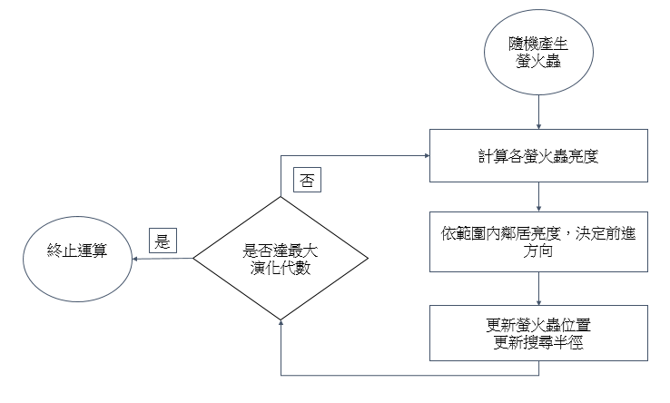
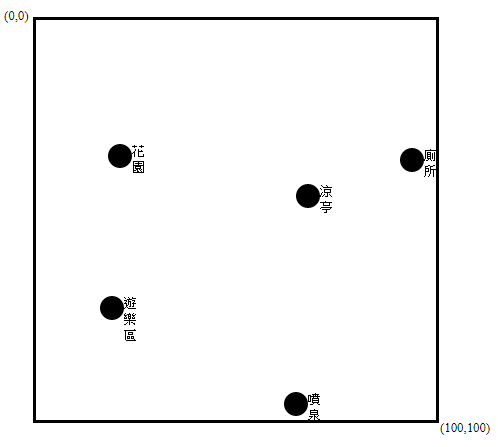
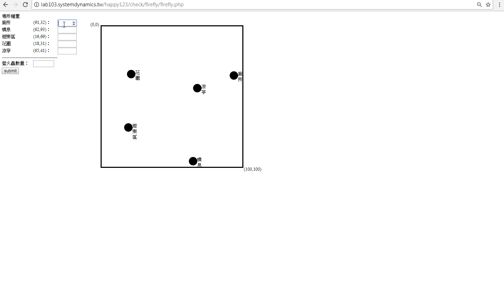

### firefly algorithm demo

> 螢火蟲演算法(firefly algorithm)是一種啟發式算法，靈感來自於螢火蟲閃爍的行為。

> 螢火蟲的閃光，其主要目的是作為一個信號系統，以吸引其他的螢火蟲。

以下為螢火蟲演算法的流程圖

***
#螢火蟲演算法應用

> 近幾年野餐風氣盛行，某天，小黑想要到戶外野餐，可是遇到一個問題，那就是到底要在哪個地點野餐比較好呢。

> 首先我們來到了丹尼公園,丹尼公園場地很大,為了滿足每一位遊客的需求,我們需要針對不同的遊客決定哪個地點比較適合露營野餐。

公園平面圖

現在開始，小黑要決定一下條件
1. 場所權重
* 廁所
* 噴泉
* 遊樂區
* 花園
* 涼亭
2. 螢火蟲數量

Demo

Demo網址[Here](http://lab103.systemdynamics.tw/happy123/check/firefly/firefly.php)
